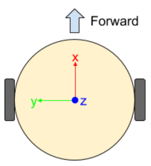
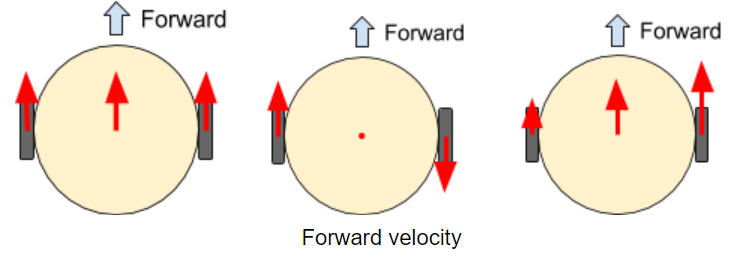
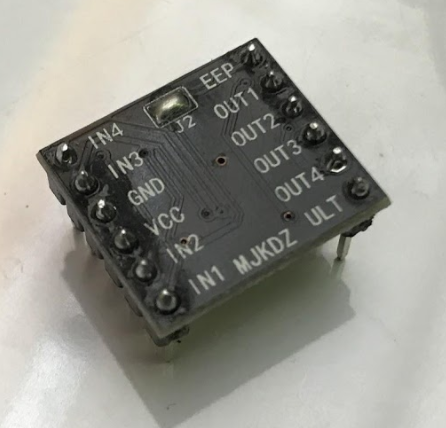
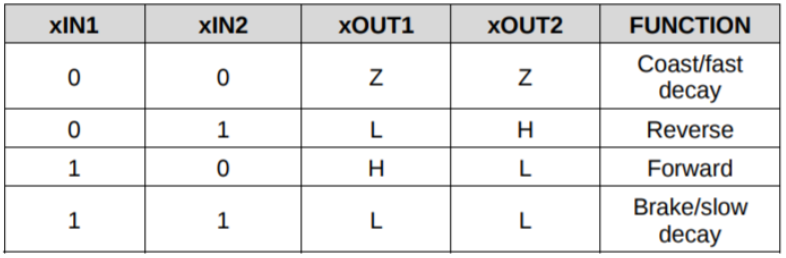

# Lab 4: Odometry and Motor Control

## Background

### Odometry

Now that we know how to read the encoders on our mouse, we can use that to estimate the position and orientation of our mouse at any given time. This is a form of *odometry*.

Why is odometry important? Suppose we want our mouse to move forward by one maze cell. We could turn on both motors for a fixed amount of time, and hope the mouse moves exactly the distance we want it to. In practice, this doesn’t work due to friction, changing battery voltage, and many other factors. The difference between the desired movement and the actual movement is called *error*, and knowing the error is the first step towards correcting it.

Using the measurements from both wheels, we can compute the odometry for the entire mouse. Our mouse is a *differential drive* robot, which means that it has two drive wheels located side by side. Both wheels turning in the same direction causes forward (or backward) motion, and both wheels turning in opposite directions causes rotation.

When we describe the position and velocity of a robot, we are actually describing the position and velocity of a single point somewhere on the robot. For a differential drive robot like our mouse, this point is usually taken to be halfway between the wheels. Since a point can’t have a rotational velocity, the “point” is actually a *coordinate frame*. You can think of a coordinate frame as a set of coordinate axes that are “attached” to the mouse and move/rotate with it.

<p align="center">
    
</p>

Consider the coordinate frame in the diagram above. When the mouse moves forward, it moves in the positive x direction. When the mouse rotates, it rotates around the z axis (which points upwards). The concept of coordinate frames is fundamental to robotics, but we won’t be able to cover it in much depth (try EECS C106A if you're interested in this type of stuff!). Fortunately, we only need to know some basics.

<p align="center">
    
</p>

We are mostly interested in the forward distance and rotational distance of our mouse. Intuitively, the center of the mouse moves with a distance that is the average of the wheel distances. Rotation in radians is arc distance divided by diameter which in our case would be the difference in wheel distances divided by the distance between the wheels. We can derive the following formulas.

<p align="center">
    
    <br>
    
</p>

### Motor Control

To make the mouse move, we use brushed DC motors. Applying a voltage across them makes the motor spin in one direction. Reversing this voltage makes the motor spin in the other direction.

Motors need large amounts of current and as such our Pi Pico can't drive them directly from its IO like we could with the LEDs. To solve this problem, we use the DRV8833 motor driver chip. It can drive two small motors and includes features like overcurrent protection and PWM control.

<p align="center">
    
</p>

Above is the DRV8833 breakout board we use in our mouse. One of the motors is connected to the OUT1 and OUT2 pins while the other is connected to the OUT3 and OUT4 pins. The Pi Pico is connected to the INx pins to allow it to control the corresponding OUTx pins.

Since the DRV8833 is a high power device, it needs to be powered off the 9V lithium battery included with your mouse. When using the motors, turn on the switch on your mouse to connect the battery.

To control the motors, we can reference the [datasheet](https://www.ti.com/lit/ds/symlink/drv8833.pdf). The relevant section is copied below for convenience.

<p align="center">
    
</p>

`1` means setting a pin to `True` while `0` means setting it to `False`. `Z` means the pin is "disconnected" which is also known as high impedance mode. Since we power the DRV8833 with 9V, `H` means 9V and `L` means 0V.

## Odometry

Translate the odometry equations into code by filling in the TODOs in the below code. Note that you'll first have to convert the number of encoder ticks to the actual distance traveled.

```python
import board
import time
import rotaryio
from math import pi

lenc = rotaryio.IncrementalEncoder(board.GP12, board.GP13)
renc = rotaryio.IncrementalEncoder(board.GP19, board.GP18)

ENCODER_TICKS_PER_REVOLUTION = """TODO from previous lab"""
WHEELBASE_DIAMETER = """TODO measure this in mm"""
WHEEL_DIAMETER = 34.0 # mm

while True:
    left_dist  = """TODO"""
    right_dist = """TODO"""

    dist  = """TODO"""
    theta = """TODO"""

    print(dist, theta)
    time.sleep(0.05)

```

### Checkoff #1

1. Demonstrate your working code.
2. How many millimeters does a wheel travel per encoder tick?

## Motor Control

Based on the table from the datasheet, the DRV8833 can easily put motors in forward or reverse at full power and even stop. What if we want to use a different speed? To do this we can switch between full power and stop really quickly so that we average out somewhere in between based on the proportion of time we spend in each. This is the main idea behind PWM (Pulse Width Modulation).

CircuitPython has a builtin module for this called `pwmio`. Documentation for it can be located [here](https://circuitpython.readthedocs.io/en/latest/shared-bindings/pwmio/index.html). The important values in PWM are duty cycle and frequency. Duty cycle determines the percentage of time within a cycle spent on. In the case of `pwmio`, it's a 16-bit number (0-65535). Frequency is determined by the total of the on and off times and is specified in Hertz. Since frequency determines the noise, we'll keep it at 20kHz to be at the edge of human hearing.

Look at the `pwmio` documentation and fill in the TODOs below. A duty cycle of 0 or 65535 will set a pin to be completely off or on, respectively. For reasons best explained in a nice [article](https://learn.adafruit.com/improve-brushed-dc-motor-performance/choosing-decay-mode-and-pwm-frequency), we want to switch between the forward and slow decay states of the DRV8833 for PWM.

```python
import board
import pwmio

lmot_in1 = """TODO create PWMOut object on pin GP16 at 20kHz"""
lmot_in2 = """TODO create PWMOut object on pin GP17 at 20kHz"""

while True:
    lmot_in1.duty_cycle = """TODO set to 25% speed forward"""
    lmot_in2.duty_cycle = """TODO set to 25% speed forward"""
```

### Checkoff #2

1. Demonstrate your left wheel spinning forward at 25% speed.
2. What happens if we swap the two PWM pins?

## Motor Control w/ Library

Having to deal with PWM outputs and duty cycles can get tedious. As is usually the case, CircuitPython provides a nice library named `motor` for this very thing. Read the [documentation](https://circuitpython.readthedocs.io/projects/motor/en/latest/api.html) and fill out the TODOs in the following code.

```python
import board
import time
import pwmio
import adafruit_motor.motor as motor

"""TODO don't forget to make PWMOut objects first"""

lmot = """TODO create DCMotor object on pins GP16 and GP17"""
rmot = """TODO create DCMotor object on pins GP15 and GP14""" 

"""TODO set lmot and rmot to SLOW_DECAY"""

while True:
    """TODO move full speed forward for 1s"""

    """TODO brake for 1s"""

    """TODO move 25% speed backward for 1s"""

    """TODO brake for 1s"""
```

### Checkoff #3

1. Demonstrate your code is working.
2. What happens if we pass a `throttle` value larger than 1.0 or -1.0?
